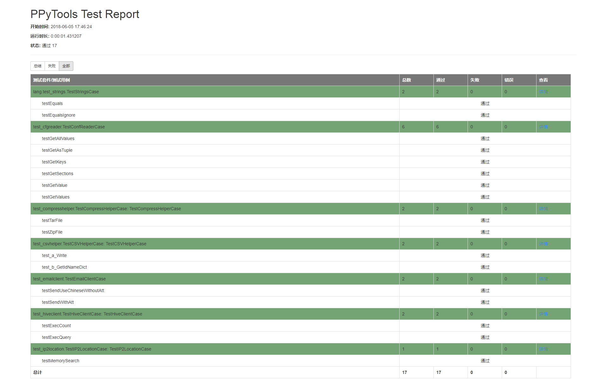

# PPyTools

**`PPyTools`** this name make by myself. It's group by `PP`(my lover's name first word) + `Py` + `Tools`.  

It's a common library utility that in **Python** project. Hope it can help you usefully on work or others.
 
 
# Test Report
[PPyTools Rest Report](test/reports/ppytools_test_report.html)
